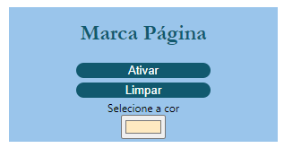

<h1 align="center">
  
   
  Marca Página 
</h1>

<i>"Marcador de textos para páginas HTML"</i>

# Como se usa?

1. Basta clicar na extensão
2. Clique em ativar
3. Clique no paragrafo que desesa marcar
4. Quando entrar de novo no site o paragrafo estará marcado

   

  

